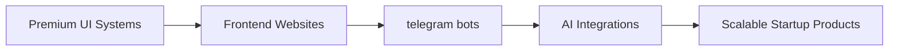

<div align="center">


<a href="https://git.io/typing-svg">
  
</a>

<br/>


<br/><br/>

<a href="https://mlabs-five.vercel.app"></a>
<a href="mailto:touseefparay7@gmail.com"></a>
<a href="https://github.com/mudassir131-dev"></a>
<a href="https://www.linkedin.com/in/mudasir-ahmad-paray"></a>

<br/><br/>


</div>

<br/>

## ⟢ About Me

```yaml
engineer:
  name: "Mudasir Ahmad Paray"
  title: "Full Stack Developer & Android Engineer"
  based_in: "Baramulla, Jammu & Kashmir, India"
  languages: ["English", "Urdu", "Kashmiri (Native)"]
  philosophy: "Clean architecture, performance-first engineering, and delightful UX"
```

I'm a **Full Stack & Android Developer** focused on building modern, scalable, production-grade applications with a strong emphasis on **clean architecture (MVVM)**, **offline-first design**, and **cloud-integrated systems**. My core toolkit centers around **Kotlin, Jetpack Compose**, and modern web technologies, backed by hands-on experience across **Firebase, Supabase, MongoDB, and Cloudflare** infrastructure.

Beyond application development, I actively contribute to **open source**, maintaining and improving real-world projects used by a growing community — handling everything from architecture decisions to issue triage and release management.

**Open To:**

- 🟣 Full Stack Developer roles (Web & Mobile)
- 🟣 Android / Kotlin Engineering positions
- 🟣 Open Source collaboration & maintainership
- 🟣 Freelance product builds (offline-first apps, dashboards, internal tools)

---

## ⟢ Tech Stack

**Languages**


**Frontend**


**Backend, Databases & Cloud**


**Tools & DevOps**


---

## ⟢ AI / ML & Applied Engineering Focus

<div align="center">

| Domain | Proficiency | Details |
|---|:---:|---|
| Clean Architecture (MVVM) | ⭐⭐⭐⭐⭐ | Repository pattern, use-case driven design across Android apps |
| Offline-First Systems | ⭐⭐⭐⭐⭐ | Room DB caching, auto-backup, sync-on-reconnect strategies |
| Cloud & Backend Integration | ⭐⭐⭐⭐☆ | Firebase Auth (Custom Claims), Firestore rules, Cloud Functions |
| API Integration | ⭐⭐⭐⭐☆ | YouTube API, Retrofit, REST services, WhatsApp API |
| CI/CD Automation | ⭐⭐⭐⭐☆ | GitHub Actions for automated builds & releases |
| Embedded / IoT Systems | ⭐⭐⭐☆☆ | Arduino IDE, sensor integration, microcontroller programming |

</div>

---

## ⟢ Featured Projects

<details open>
<summary><b>🎵 Nocturne — YouTube Music Streaming App</b></summary>

<br/>

An open-source YouTube client for music streaming with background playback, offline downloads, and a premium UI/UX experience — built with a fully clean, MVVM architecture.

- Built using **Kotlin, Jetpack Compose** with Clean Architecture (MVVM)
- Integrated **YouTube API** for seamless search and playback
- Offline downloads, audio-only mode & background playback support
- Local caching layer powered by **Room Database**
- **GitHub Actions CI/CD** for automated builds and releases

| Stack | Scale | Performance | Security | Impact |
|---|---|---|---|---|
| Kotlin, Compose, Room, Retrofit, YouTube API | Open-source, active community | Optimized playback with local caching | Scoped API access, secure token handling | Actively used & maintained by contributors |

**Repository:** [github.com/mudassir131-dev/nocturne](https://github.com/mudassir131-dev/nocturne)

</details>

<details>
<summary><b>🧾 BillCraft — Offline Billing & Inventory App</b></summary>

<br/>

A feature-rich, offline-first billing and inventory management application built for small businesses, enabling seamless invoicing, stock management, and reporting without internet dependency.

- Create invoices, manage products, customers, and stock
- Offline-first architecture with **Room Database** and auto backup
- **PDF invoice generation** with WhatsApp sharing integration
- Clean architecture with **Repository pattern**
- Dark & Light mode with modern **Material 3** UI

| Stack | Scale | Performance | Security | Impact |
|---|---|---|---|---|
| Kotlin, Compose, Room, Coroutines, PDF Engine, WhatsApp API | Business-ready, offline-capable | Fully local-first, zero network dependency | Local data isolation, backup encryption-ready | Streamlines invoicing for small businesses |

**Repository:** *Private / Available on request*

</details>

<details>
<summary><b>🏫 HSS Authoora — School Management App</b></summary>

<br/>

A secure school management application featuring role-based access control and Firebase-backed authentication for Admins, Teachers, and Students.

- Implemented **Firebase Authentication** with Custom Claims
- Role-based access for Admin, Teacher, and Student roles
- **Cloud Functions** for secure backend business logic
- Firestore security rules, real-time database & secure data handling

| Stack | Scale | Performance | Security | Impact |
|---|---|---|---|---|
| Firebase Auth, Firestore, Cloud Functions, Kotlin, MVVM | Institution-scale deployment | Real-time sync via Firestore | Custom Claims + strict Firestore rules | Digitized secure school administration |

**Repository:** *Private / Available on request*

</details>

---

## ⟢ Experience

**IoT Intern — Internship (IoT using Arduino)**
**Tata Technologies, CIIT Baramulla, in partnership with J&K Bank**
`21 January 2025 – 15 February 2026`

Worked on real-world IoT-based projects, gaining hands-on experience in embedded systems and automation using Arduino hardware and industry-standard tooling.

- Worked on IoT-based projects and real-world applications using Arduino boards
- Programmed and tested microcontrollers using **Arduino IDE**
- Integrated sensors and modules to collect, process, and transmit data
- Gained hands-on experience in embedded systems, automation, and IoT concepts

`Arduino` `IoT` `Embedded Systems` `Sensors & Automation` `C/C++`

---

## ⟢ Open Source Contribution

**Contributor — Nocturne Project**

- Actively contributing to the Nocturne music streaming app
- Bug fixes, performance improvements, and UI/UX enhancements
- Managing issues, pull requests, and community support

**Repository:** [github.com/mudassir131-dev/nocturne](https://github.com/mudassir131-dev/nocturne)

---

## ⟢ Achievements

<div align="center">

| Recognition | Details |
|---|---|
| Open Source Maintainer | Active contributor & issue manager for Nocturne — a community-used music streaming client |
| IoT Internship Completion | Completed IoT internship at Tata Technologies (CIIT Baramulla) in association with J&K Bank |
| Multi-App Portfolio | Independently designed & shipped 3+ production-grade Android applications |

</div>

---

## ⟢ Certifications

**AWS**


**Oracle**


**NPTEL**


**Cisco**


---

## ⟢ Coding Profiles

<div align="center">

<a href="https://leetcode.com/mudassir131-dev"></a>
<a href="https://www.geeksforgeeks.org/user/mudassir131-dev"></a>
<a href="https://www.hackerrank.com/mudassir131dev"></a>
<a href="https://www.codechef.com/users/mudassir131dev"></a>

</div>

---

## ⟢ GitHub Analytics

<div align="center">


</div>

---

## ⟢ GitHub Trophies

<div align="center">


</div>

---

## ⟢ Contribution Activity

<div align="center">


</div>

---

## ⟢ Contribution Snake

<div align="center">


</div>

---

## ⟢ Current Focus

```yaml
current_focus:
  learning:
    - Advanced Jetpack Compose animations & performance tuning
    - Cloud-native backend design with Supabase & Cloudflare Workers
  building:
    - Nocturne (open source music streaming client)
    - BillCraft (offline-first billing & inventory system)
  exploring:
    - AI-assisted developer tooling
    - Kotlin Multiplatform (KMP) for cross-platform engineering
  open_to:
    - Full Stack / Android engineering roles
    - Open source collaboration
    - Freelance product development
```

---

## ⟢ Connect With Me

<div align="center">

<a href="mailto:touseefparay7@gmail.com"></a>
<a href="https://www.linkedin.com/in/mudasir-ahmad-paray"></a>
<a href="https://github.com/mudassir131-dev"></a>
<a href="https://mlabs-five.vercel.app"></a>

</div>

---

<div align="center">

*"Passionate about building solutions that make an impact."*


</div>

Currently Working On:
  - Website Development
  - Telegram Bots

Mindset:
  - Precision
  - Innovation
  - Minimalism
  - Scalability

Mission:
  - Create products that feel futuristic, cinematic, and unforgettable.
```

---

# ⚒️ TECH STACK

<div align="center">


</div>

---

# 🧠 CORE DOMAINS

<div align="center">

| DOMAIN | SPECIALIZATION |
|:---:|:---:|
| 🌐 | Full Stack Development |
| 📱 | Android & Flutter Apps |
| 🎨 | Premium UI Engineering |
| 🤖 | AI & Automation |
| ⚡ | Startup Product Systems |

</div>

---

# 📊 GITHUB ANALYTICS

<div align="center">


</div>

<div align="center">


</div>

---

# 🏆 ACHIEVEMENTS

```diff
+ Building premium startup-level projects
+ Exploring AI, automation
+ Designing futuristic digital experiences
+ Constantly learning advanced technologies
```

---

# 🚀 CURRENT FOCUS

<div align="center">



</div>

---

# 🌌 DIGITAL PRESENCE

<div align="center">

<a href="https://github.com/mudassir131-dev">
  
</a>

<a href="https://instagram.com/pixelforgee.hq">
  
</a>

<a href="mailto:muhammadmud4ssir@gmail.com">
  
</a>

</div>

---

<div align="center">


</div>

---

<div align="center">


</div>

---

<div align="center">


</div>

---

<div align="center">

# ⭐ BUILDING THE FUTURE WITH CODE.


</div>
