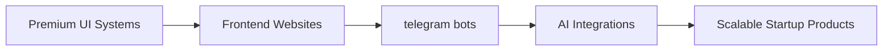

<div align="center">


</div>

<p align="center">
  
</p>

---

<div align="center">


</div>

---

# ⚡ SYSTEM PROFILE

```yaml
Name: Muhammad Mudassir

Role:
  - Engineering Student
  - telegram Bot Developer
  - Creative Technologist
  - Web Developer
  - Jr App Developer

Expertise:
  - Premium UI/UX Systems
  - Full Stack Web Apps
  - Android Development

Currently Working On:
  - Website Development
  - Telegram Bots

Mindset:
  - Precision
  - Innovation
  - Minimalism
  - Scalability

Mission:
  - Create products that feel futuristic, cinematic, and unforgettable.
```

---

# ⚒️ TECH STACK

<div align="center">


</div>

---

# 🧠 CORE DOMAINS

<div align="center">

| DOMAIN | SPECIALIZATION |
|:---:|:---:|
| 🌐 | Full Stack Development |
| 📱 | Android & Flutter Apps |
| 🎨 | Premium UI Engineering |
| 🤖 | AI & Automation |
| ⚡ | Startup Product Systems |

</div>

---

# 📊 GITHUB ANALYTICS

<div align="center">


</div>

<div align="center">


</div>

---

# 🏆 ACHIEVEMENTS

```diff
+ Building premium startup-level projects
+ Exploring AI, automation
+ Designing futuristic digital experiences
+ Constantly learning advanced technologies
```

---

# 🚀 CURRENT FOCUS

<div align="center">



</div>

---

# 🌌 DIGITAL PRESENCE

<div align="center">

<a href="https://github.com/mudassir131-dev">
  
</a>

<a href="https://instagram.com/pixelforgee.hq">
  
</a>

<a href="mailto:muhammadmud4ssir@gmail.com">
  
</a>

</div>

---

<div align="center">


</div>

---

<div align="center">


</div>

---

<div align="center">


</div>

---

<div align="center">

# ⭐ BUILDING THE FUTURE WITH CODE.


</div>
